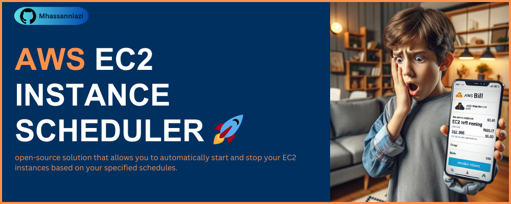

# AWS EC2 INSTANCE SCHEDULER 🤖

Companies often run multiple Amazon Elastic Compute Cloud (EC2) instances to support their applications and workloads. However, keeping these instances running 24/7 can lead to unnecessary costs. To address this issue, we've developed an AWS EC2 Instance Scheduler - an open-source solution that allows you to automatically start and stop your EC2 instances based on your specified schedules.

## Features 💫

- **Cost Optimization**: Reduce your AWS bill by scheduling your EC2 instances to run only when needed, such as during business hours.
- **Custom Schedules**: Create custom schedules for different instances or groups of instances, tailored to your organization's specific needs.
- **Easy Setup**: Simple configuration through AWS Lambda and CloudWatch Events for seamless automation.
- **Logs and Notifications**: Monitor and receive notifications about scheduled actions.

## Getting Started 🚀

To get started with our AWS EC2 Instance Scheduler, follow these steps:

- Install the [Serverless Framework](https://www.serverless.com/) if you haven't already.
- Configure instance IDs in the `start_EC2_machine.py` and `stop_EC2_machine.py` files to specify which EC2 instances you want to manage.
- Modify the cron job settings inside the `serverless.yml` file to define your desired schedules.

Finally, deploy your Instance Scheduler using command as: `serverless deploy`

## Techologies Used 💻

**Language:** Python

**AWS Services:** AWS Lambda, AWS Eventbridge, IAM

**Build Tool:** Serverless Framework

## Author

- [@Mhassanniazi](https://github.com/Mhassanniazi)

